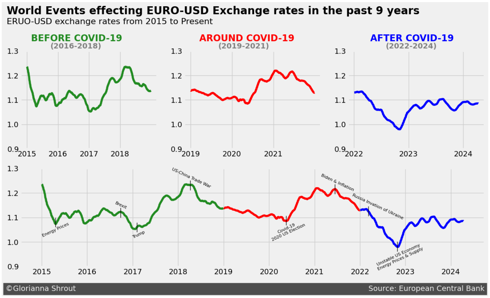

# Exchange Rates Visualization

In this short project, we will work with a dataset describing Euro daily [exchange rates](https://en.wikipedia.org/wiki/Exchange_rate) between 1999 and 2024. The dataset was compiled and made available by  Daria Chemkaeva, with the source based on the European Central Bank. It can be found on [Kaggle](https://www.kaggle.com/datasets/lsind18/euro-exchange-daily-rates-19992020). Please note that this dataset is updated regularly and was downloaded for this project in August 2024. 

Our goal for this project is to represent the data we find in forms of effective explanatory data visualization. In doing this, we will demonstrate the usefulness of Data Visualization in analyzing large datasets.

View this project live on Google Colab [here](https://colab.research.google.com/drive/1JDSrWtAdxt71Rg0N8dyXCQhkN1tqPwfh?usp=sharing).
